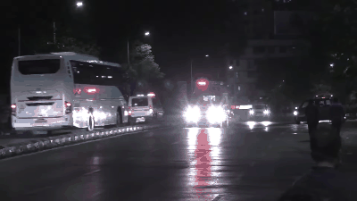
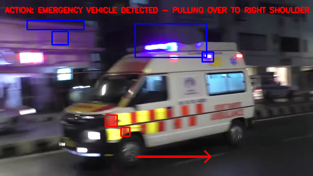

# Emergency Vehicle Detection

Detects an emergency vehicle approaching from behind by combining two independent
signals: the **alternating red/blue flashing lights** and the **siren sound**.

An alert is triggered only when **both** signals are present at the same time,
which avoids false positives from red brake lights or unrelated noise.

## Demo





Red and blue boxes mark the detected emergency lights. Once the vehicle is
confirmed, the alert banner appears and the arrow shows the car pulling over to
the right shoulder.

## How it works

**Visual detection**
1. Each frame is converted to HSV colour space
2. Two masks isolate the red and blue pixel regions (emergency light colours)
3. The dominant colour of each frame is recorded in a sliding one-second window
4. The number of red ↔ blue switches inside that window gives the flashing rate

**Audio detection**

*Video mode* (default):
1. The video's audio track is loaded as a waveform
2. For each frame, the matching half-second of audio is extracted
3. Its RMS energy is compared to a threshold

*Live mode*:
1. The microphone is read continuously in the background
2. Its level is compared to the ambient noise, which adapts slowly over time
3. A siren is detected when the level rises well above that ambient noise

**Decision**
Alert is raised when the flashing rate reaches the threshold **and** the audio
energy exceeds the siren level. Once raised, the alert latches and the avoidance
manoeuvre is displayed.

## Results on the test video

| Measurement | Value |
|---|---|
| Video | 574 frames, 50 fps, 11.6 s |
| Red ↔ blue switches per second | 22 (threshold: 2) |
| Audio RMS range | 0.030 to 0.071 (threshold: 0.042) |
| **Detection triggered at** | **0.84 s** |
| Frames with alert active | 532 / 574 |

## Installation

```bash
pip install -r requirements.txt
```

## Usage

```bash
python main.py
```

Press **Q** to quit.

The source is chosen with `MODE` at the top of `main.py`:

| `MODE` | Images | Sound |
|---|---|---|
| `"video"` (default) | `ambulance.mp4` | audio track of the video |
| `"live"` | camera 0 (rear camera) | microphone |

The window shows the rear camera feed with bounding boxes around the detected
lights. When an emergency vehicle is identified, a red alert banner appears
together with an arrow showing the vehicle pulling over to the right shoulder.

## Parameters

| Parameter | Value | Role |
|---|---|---|
| `MODE` | `"video"` | `"video"` for the test file, `"live"` for camera + microphone |
| `seuil_alternance` | 2 | minimum red ↔ blue switches per second |
| `seuil_sirene` | 0.042 | RMS energy above which a siren is considered present |
| HSV red ranges | 0 to 10 and 170 to 180 | red wraps around the hue circle, hence two ranges |
| HSV blue range | 100 to 140 | |

`seuil_sirene` is used in video mode. It is calibrated on the test video, whose audio RMS has a median of
0.042: the siren's wail oscillates around that level, so the peaks cross it.

## Video credit

`ambulance.mp4` is the video
[Ambulance Running on Road, Free to Use this Video](https://www.youtube.com/watch?v=g8bdycR6YnI)
by **Free Video Library** on YouTube, published under the
[Creative Commons Attribution (CC BY)](https://creativecommons.org/licenses/by/3.0/) license.
`demo.gif` and `alert_capture.png` are frames taken from it, with the detection overlays added.
